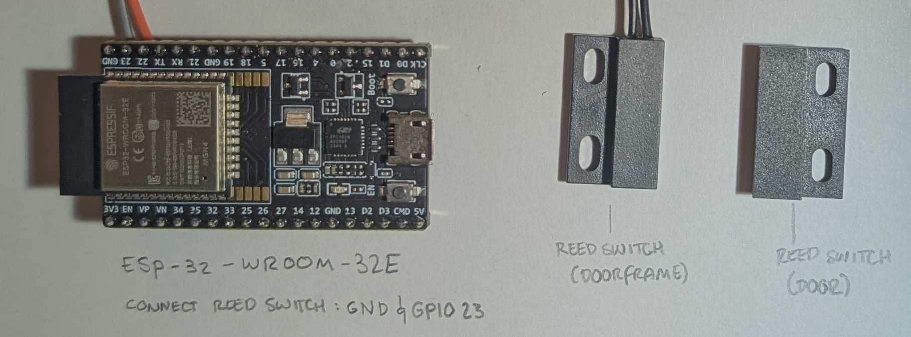

# Tripwire - ESP32 Door Monitor with Bluetooth Authentication

A smart door monitoring system using ESP32-WROOM-32E that detects door events and authenticates them via Bluetooth. Sends notifications to your phone showing whether door activity was authorized (your phone nearby) or unauthorized.

📝 [Read the blog post](https://konukoii.com/blog/2025/10/15/vibecoding-an-esp32-door-monitor/) about building this project


## Quick Start

### Hardware Requirements
- ESP32-WROOM-32E development board ([Amazon](https://www.amazon.com/dp/B09MQJWQN2))
- Magnetic reed switch ([Amazon](https://www.amazon.com/dp/B09ZTP1S4Q))
- Jumper wires
- WiFi network with internet access

### Setup Steps

1. **Wire the Hardware**:
   - Reed switch → GPIO 23 & GND
   - Built-in LED on GPIO 2 provides status feedback (Note: LED not availble on some boards)

2. **Create Environment File**:
   ```bash
   # Create .env file in project root
   export DOOR_WIFI_SSID="YourWiFiNetwork"
   export DOOR_WIFI_PASSWORD="YourPassword"
   export DOOR_PHONE_BT_MAC="aa:bb:cc:dd:ee:ff"  # Your phone's Bluetooth MAC
   export DOOR_NTFY_URL="https://ntfy.sh/your_unique_complex_topic_name"
   ```

3. **Build and Flash**:
   ```bash
   ./build.sh flash monitor
   ```

4. **Setup Phone Notifications**:
   - Install ntfy app (iOS/Android)
   - Subscribe to your topic URL
   - Enable Bluetooth on your phone



## How It Works

- **Door opens/closes** → ESP32 detects via reed switch
- **Bluetooth check** → Attempts to connect to your phone's MAC address (3 second window)
- **Authentication result**:
  - Phone responds: `🚪 Door Open/Close (10:50 AM)`
  - No response: `🚪 Door Open/Close (10:50 AM) ⚠️ (Unauthenticated)`

## Configuration

Your `.env` file contains all sensitive data and is never committed to git. The `build.sh` script populates configuration from environment variables.

**Getting Your Phone's Bluetooth MAC**:
- **Android**: Settings → About → Status → Bluetooth address
- **iOS**: Settings → General → About → Bluetooth address

## Features

- **Bluetooth Authentication**: Knows when you (vs. someone else) opened the door
- **Smart Event Batching**: Combines quick open/close pairs to reduce notification spam
- **Offline Queueing**: Events saved during WiFi outages
- **NTP Time Sync**: Accurate timestamps in notifications
- **Low Power Ready**: Architecture supports battery operation

## Build System

You may choose to use `build.sh` instead of direct `idf.py` commands:

```bash
# Basic build
./build.sh

# Build and flash
./build.sh flash

# Build, flash, and monitor
./build.sh flash monitor

# Just monitor
./build.sh monitor
```

The script automatically:
- Loads environment variables from `.env`
- Generates `sdkconfig.defaults` from template
- Removes old `sdkconfig` to force regeneration
- Runs ESP-IDF build system

## Project Structure

```
Tripwire/
├── .env                      # Your credentials (create this)
├── build.sh                  # Build script with env var support
├── sdkconfig.defaults.template  # Template with placeholders
├── sdkconfig.defaults        # Generated from template (git tracked)
├── main/
│   ├── door_monitor.c        # Main application
│   ├── CMakeLists.txt        # Build dependencies
│   └── Kconfig.projbuild     # Configuration options
└── CMakeLists.txt
```

## Advanced Configuration

### Timezone Settings
Edit `main/door_monitor.c` to change timezone:
```c
setenv("TZ", "PST8PDT,M3.2.0/2,M11.1.0", 1);  // Pacific Time
setenv("TZ", "EST5EDT,M3.2.0,M11.1.0", 1);    // Eastern Time
```

### Memory Optimization
The project includes extensive memory optimizations for the ESP32-WROOM-32E's limited IRAM. Configuration in `sdkconfig.defaults` includes compiler optimization, disabled features, and reduced buffer sizes.

### Bluetooth Technical Details
- Uses ESP32 Classic Bluetooth (not BLE)
- Attempts SPP (Serial Port Profile) connection
- Any response (success or failure) indicates phone presence
- No pairing required - just connection attempt
- ~3 second authentication window

## Troubleshooting

**Stack Overflow Errors**: Increase `CONFIG_ESP_MAIN_TASK_STACK_SIZE` in `sdkconfig.defaults`

**Build Fails**: Ensure you have ESP-IDF v5.5+ and run `./build.sh` (not `idf.py` directly)

**Authentication Not Working**:
- Verify phone's Bluetooth MAC address in `.env`
- Ensure phone Bluetooth is enabled
- Check ESP32 logs for connection attempt details

**WiFi Issues**: Check credentials in `.env` and ensure 2.4GHz network

## Security Disclaimer

⚠️ **Important Security Considerations**

This project prioritizes simplicity over security. Be aware of these limitations:

- **ntfy.sh is public**: Unless you pay for a reserved topic, anyone can subscribe to your notifications. Choose a complex, unique topic name and avoid sensitive information in messages.

- **HTTP Communication**: ntfy.sh calls are made over HTTP, not HTTPS, meaning messages could potentially be intercepted.

- **Bluetooth Spoofing**: The Bluetooth authentication can be defeated by someone spoofing your phone's MAC address with appropriate hardware/software.

- **No Encryption**: Door events and notifications are not encrypted end-to-end.

These risks were deemed acceptable for a basic door monitor, but evaluate them for your specific use case. Consider these limitations when deciding what information to include in notifications and where to deploy the device.

## License

BSD 3-Clause License. See LICENSE file for details.
